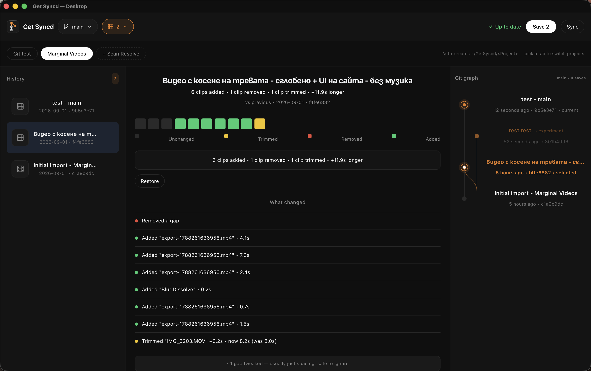

# Get Syncd

[](https://opensource.org/licenses/MIT)
[](https://www.python.org/downloads/)
[](https://developer.apple.com/macos/)
[](https://www.microsoft.com/windows)
[](https://www.kernel.org/)
[](https://www.blackmagicdesign.com/products/davinciresolve)

Version control for DaVinci Resolve timelines. No more `MyFilm_v3_FINAL_FINAL.drp`.

Hit Save and you can see what actually changed between any two versions — "trimmed 2 clips, added 1, runtime +1.2s" — then jump back to any old cut without digging through old project files. The desktop app auto-exports the current timeline from Resolve via the scripting API, so there's usually no manual export step; if auto-export can't reach Resolve, fall back to `File → Export Timeline → OpenTimelineIO`.

Media stays on your drive. Only the timeline structure (clip order, trims, gaps) goes into git, so it's tiny and works fine on the free GitHub plan. Works with Resolve Free — you don't need Studio.

There's a CLI if you like the terminal, and a desktop app if you don't.

### Download

Grab the installer for your OS from [**Releases**](https://github.com/MihailM17/get-syncd/releases) - `.dmg` (macOS), `.msi`/`.exe` (Windows), `.AppImage` (Linux). It bundles everything, starts its own background service, and opens with a first-run wizard that finds Resolve and sets up `~/GetSyncd` for you.

### See it in action



*The sidecar app: history on the left with timeline-bar thumbnails, preview + plain-English diff on the right. Click any version to see what changed vs latest.*

### Traditional workflow vs Get Syncd

| Aspect | Traditional (`MyFilm_v4_FINAL.drp`) | Get Syncd |
|--------|-------------------------------------|-----------|
| **History** | Manual file copies, cryptic names | `get-syncd log` — one-line summaries |
| **Compare** | Open two .drp files, eyeball | `get-syncd diff HEAD~1 HEAD` — "3 trimmed, 1 added, runtime +1.2s" |
| **Restore** | Hunt for right .drp, re-import | `get-syncd restore HEAD~3` → Import OTIO |
| **Storage** | Full project files (GBs) | OTIO text (~KBs), fits free GitHub |
| **Branching** | Duplicate folders | `get-syncd branch experiment` — instant |
| **Collaboration** | WeTransfer .drp files | `git push` / PRs on GitHub |

### How it works

`Save button` → auto-export current timeline from Resolve → `timeline.otio` → git commit → (optional) push to GitHub. (Manual fallback: `File → Export Timeline → OpenTimelineIO`.)

Restoring writes the old `.otio` back and auto-imports it into the open Resolve project when the scripting API allows it; otherwise it tells you the manual `File → Import Timeline → OpenTimelineIO` steps.

### Quick start

```bash
pip install -e .  # or uv pip install -e .

# in your film folder (next to where you export timeline.otio)
get-syncd init
get-syncd save -m "rough cut v1 - 5 clips"
get-syncd status        # any unsaved changes?
get-syncd log           # history
get-syncd diff HEAD~1 HEAD
get-syncd view          # visual diff in browser
get-syncd restore HEAD~1 --out /tmp/old.otio
# then in Resolve: File → Import Timeline → OpenTimelineIO → /tmp/old.otio
```

### Install

Pick your OS (Python 3.10+, git required):

```bash
./install-mac.sh        # macOS
./install-linux.sh      # Linux (apt/dnf/pacman)
.\install-windows.ps1   # Windows (PowerShell; needs Python + git on PATH)
```

Then:

```bash
source .venv/bin/activate  # Windows: .\.venv\Scripts\Activate.ps1
get-syncd --help
pytest -q  # 29 passed
```

Step-by-step per OS: [MAC_GUIDE.md](MAC_GUIDE.md) · [WINDOWS_GUIDE.md](WINDOWS_GUIDE.md) · [LINUX_GUIDE.md](LINUX_GUIDE.md)

### Desktop app

If you prefer clicking:

```bash
get-syncd gui          # Tk sidecar — simple, stays next to Resolve
# or the Tauri build:
cd app && npm install && npm run tauri:dev   # dev
npm run tauri:build    # release bundle for your OS (.app / .exe / .AppImage)
```

Ready-made bundles for all three OSes are built by CI (`.github/workflows/build.yml`) on every push to `master`. The app watches `~/GetSyncd` by default (resolved per-OS, never hardcoded). Hit Save — it auto-exports the current Resolve timeline — type a note, done. History shows up on the left, preview + diff on the right. Branches, restore, delete, Scan Resolve to auto-create project folders, and Sync Resolve to snapshot the open project's timeline list.

### Why OTIO + git?

- `.drp` files are binary blobs — git can't diff them in a useful way.
- OTIO is JSON describing your timeline. Git diffs that fine, and `get-syncd` turns it into plain English.
- You don't need to learn git. `save` / `log` / `diff` / `restore` is the whole surface.

### Notes

- Primary dev happens on macOS Apple Silicon, Resolve 18.5+ Free — no Studio needed. Linux and Windows are supported: Resolve scripting paths are detected per-OS, and CI runs the test suite on all three.
- The desktop Sync button is currently a status check only — real push is `git push` (or `get-syncd push`) to whatever remote you linked with `get-syncd init --remote` or `git remote add origin ...`.
- Media paths are absolute — if you move drives, relink in Resolve's Media Pool like you normally would.
- The local API listens on `http://127.0.0.1:5174` only and refuses repos outside `~/GetSyncd`.

MIT — do what you want with it. Issues and small PRs welcome.
